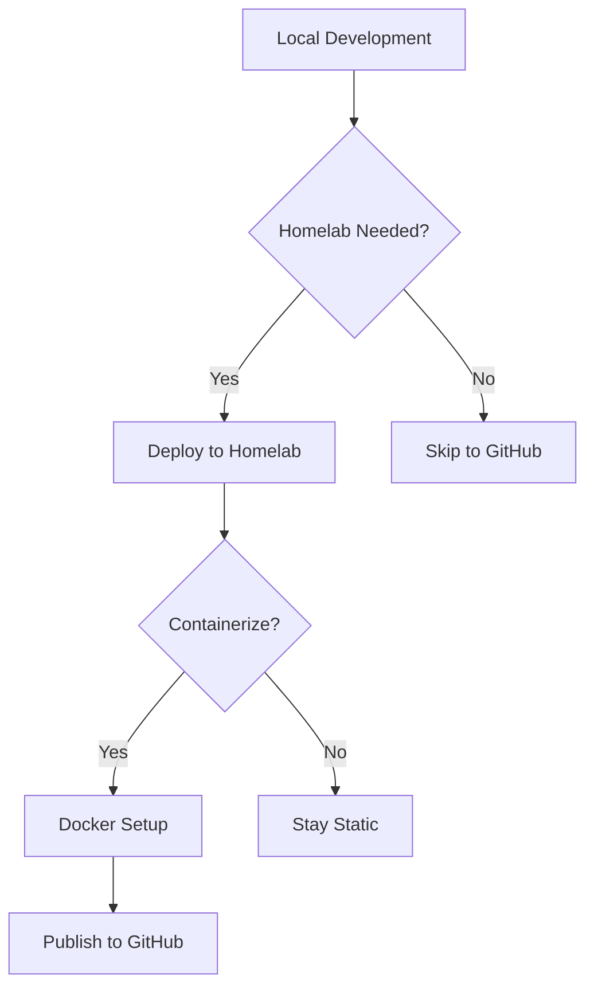

# Recommendations for AI Agent Development Documentation

## Executive Summary

This document provides recommendations for improving the documentation set in this repository. The current collection includes valuable content on contribution protocols, microservice workflows, and AI tooling philosophy, but would benefit from better organization, cross-referencing, and structural improvements.

---

## 1. Repository Structure & Organization

### Current Issues
- Documents are isolated in a `Sandbox/` folder with unclear purpose
- No root-level README to orient new readers
- Missing navigation/index document
- No clear relationship between documents

### Recommendations

#### 1.1 Create Root README.md
**Priority: High**

Create a comprehensive README that:
- Explains the repository's purpose and audience
- Provides a navigation guide to all documents
- Includes quick-start links for different use cases
- Lists prerequisites and dependencies
- Shows the relationship between documents

**Suggested Structure:**
```markdown
# AI Agent Development Documentation

This repository contains guides and protocols for AI-assisted software development.

## Quick Navigation
- [Contribution Guide](Sandbox/contributing.md) - How to contribute (AI agents & humans)
- [Microservice Workflow](Sandbox/microservice-workflow-guide.md) - Progressive enhancement workflow
- [Custom AI Tooling](Sandbox/The%20Case%20for%20Custom%20AI%20Tooling.md) - Philosophy & patterns

## For AI Agents
Start with [contributing.md](Sandbox/contributing.md) to understand repository protocols.

## For Human Developers
[Microservice Workflow Guide](Sandbox/microservice-workflow-guide.md) provides a complete development workflow.
```

#### 1.2 Reorganize Directory Structure
**Priority: Medium**

Consider restructuring:
```
/
├── README.md
├── guides/
│   ├── contributing.md
│   ├── microservice-workflow-guide.md
│   └── custom-ai-tooling.md (renamed)
├── examples/
│   └── (example projects referenced in guides)
└── templates/
    └── (templates referenced in microservice guide)
```

**Benefits:**
- Clearer organization
- Easier to find related content
- Better separation of guides vs. examples

#### 1.3 Create Document Index/Navigation
**Priority: Medium**

Add a `docs/index.md` or navigation section that:
- Maps documents by topic
- Shows document relationships
- Provides reading order recommendations
- Links to external resources

---

## 2. Content Improvements

### 2.1 contributing.md Enhancements
**Priority: High**

**Current State:** Very brief, only covers branching strategy

**Recommended Additions:**

1. **Complete the Setup Section**
   - Add missing closing backtick in setup command
   - Include pre-commit checklist
   - Add validation steps

2. **Expand with Additional Sections:**
   - Commit message conventions
   - Pull request process
   - Code review guidelines
   - Testing requirements
   - Documentation standards
   - Conflict resolution

3. **Add Human Contributor Guidelines**
   - Currently only addresses AI agents
   - Should include guidelines for human contributors
   - Clarify when humans vs. agents should contribute

4. **Include Examples:**
   - Good vs. bad branch names
   - Example commit messages
   - Example PR descriptions

**Suggested Structure:**
```markdown
# Repository Contribution Protocols

## For AI Agents
[Current content]

## For Human Contributors
[New section]

## Branching Strategy
[Current content, fixed]

## Commit Guidelines
[New section]

## Pull Request Process
[New section]
```

### 2.2 microservice-workflow-guide.md Enhancements
**Priority: Medium**

**Current State:** Comprehensive but could be more navigable

**Recommended Improvements:**

1. **Add Table of Contents**
   - Document is 1300+ lines
   - Needs clickable TOC at the top
   - Consider splitting into multiple documents

2. **Add Visual Diagrams**
   - Workflow diagrams (Mermaid or ASCII art)
   - Architecture diagrams for each level
   - Decision trees as visual flowcharts

3. **Improve Code Examples**
   - Add syntax highlighting verification
   - Include error handling examples
   - Add "what could go wrong" scenarios

4. **Add Quick Reference Cards**
   - One-page cheat sheet
   - Common commands reference
   - Troubleshooting quick lookup

5. **Enhance Examples Section**
   - Add more complete example projects
   - Include before/after comparisons
   - Add links to real-world examples

6. **Add Version/Changelog Section**
   - Document is versioned but changelog is minimal
   - Add detailed version history
   - Note breaking changes

7. **Cross-Reference Other Docs**
   - Link to contributing.md for git workflow
   - Reference custom AI tooling doc where relevant

### 2.3 The Case for Custom AI Tooling.md Enhancements
**Priority: Low-Medium**

**Current State:** Well-written philosophical piece

**Recommended Improvements:**

1. **Add Concrete Examples**
   - Real-world case studies
   - Before/after comparisons
   - Code examples showing the difference

2. **Add Implementation Guide**
   - Step-by-step guide for building custom APIs
   - Template for MCP server creation
   - Example implementations

3. **Add Links & References**
   - Link to MCP documentation
   - Reference related tools
   - Academic papers or articles

4. **Add Visual Diagrams**
   - Current ASCII diagram could be improved
   - Add sequence diagrams for workflows
   - Show data flow

5. **Add Metrics & Benchmarks**
   - Quantify the "10-100x" improvement claim
   - Add measurement methodology
   - Include real-world data if available

6. **Rename File**
   - Remove spaces: `custom-ai-tooling.md` or `the-case-for-custom-ai-tooling.md`
   - Better for URLs and tooling

---

## 3. Consistency & Formatting

### 3.1 Standardize Formatting
**Priority: Medium**

**Issues Found:**
- Inconsistent heading styles
- Mixed use of code block formats
- Inconsistent list formatting
- Different metadata sections

**Recommendations:**
- Use consistent heading hierarchy (H1 for title, H2 for major sections)
- Standardize code block language tags
- Use consistent list styles (dash vs. asterisk)
- Add frontmatter to all documents:
  ```yaml
  ---
  title: Document Title
  description: Brief description
  last_updated: YYYY-MM-DD
  version: X.Y
  ---
  ```

### 3.2 Standardize Code Examples
**Priority: Medium**

- Ensure all code blocks have language tags
- Use consistent indentation (2 spaces vs. 4 spaces)
- Add comments explaining non-obvious code
- Include expected output where relevant

### 3.3 Add Metadata to All Documents
**Priority: Low**

Each document should include:
- Author/contributor credits
- Last updated date
- Version number
- Related documents
- Tags/categories

---

## 4. Discoverability & Cross-Referencing

### 4.1 Add Cross-References
**Priority: High**

**Current State:** Documents exist in isolation

**Recommendations:**
- Link from contributing.md to microservice guide (for deployment workflow)
- Link from microservice guide to custom tooling doc (for agent workflows)
- Create "See Also" sections in each document
- Add "Related Topics" callouts

### 4.2 Add Search/Index Capabilities
**Priority: Low**

Consider:
- Adding tags/keywords to documents
- Creating a searchable index
- Adding a glossary of terms
- Creating topic-based navigation

### 4.3 Improve File Naming
**Priority: Medium**

- `The Case for Custom AI Tooling.md` → `custom-ai-tooling.md` or `the-case-for-custom-ai-tooling.md`
- Use kebab-case for all filenames
- Make filenames descriptive but concise

---

## 5. Practical Enhancements

### 5.1 Add Troubleshooting Sections
**Priority: Medium**

**Current State:** microservice guide has troubleshooting, others don't

**Recommendations:**
- Add troubleshooting to contributing.md (common git issues)
- Add troubleshooting to custom tooling doc (API implementation issues)
- Create a shared troubleshooting guide

### 5.2 Add Validation/Testing
**Priority: Low**

- Add markdown linting configuration
- Add link checking
- Add spell checking configuration
- Add CI/CD to validate documentation

### 5.3 Add Interactive Elements
**Priority: Low**

Consider:
- Interactive decision trees
- Code playgrounds for examples
- Embedded diagrams (Mermaid, PlantUML)
- Video tutorials (links)

### 5.4 Create Templates
**Priority: Medium**

The microservice guide references templates but they're embedded in the doc. Consider:
- Extracting templates to separate files
- Creating a `templates/` directory
- Versioning templates separately
- Adding template validation

---

## 6. Missing Content

### 6.1 Add Glossary
**Priority: Medium**

Create a shared glossary for:
- Technical terms
- Acronyms
- Tool names
- Concepts

### 6.2 Add FAQ Section
**Priority: Low**

Common questions:
- When should I use this workflow?
- How do I know which level to start at?
- What if I need to go backwards?
- How do I contribute improvements?

### 6.3 Add Best Practices Guide
**Priority: Medium**

Compile best practices from across documents:
- Git workflow best practices
- Docker best practices
- API design best practices
- Documentation best practices

### 6.4 Add Migration Guides
**Priority: Low**

- Guide for migrating from static to containerized
- Guide for adding agent APIs to existing projects
- Guide for adopting contribution protocols

---

## 7. Technical Improvements

### 7.1 Add Diagrams
**Priority: High**

**Recommendations:**
- Use Mermaid for flowcharts and diagrams
- Add architecture diagrams
- Create sequence diagrams for workflows
- Add state diagrams where relevant

**Example for microservice guide:**


### 7.2 Add Code Validation
**Priority: Low**

- Ensure all code examples are syntactically correct
- Test all commands in examples
- Verify all file paths
- Check all URLs/links

### 7.3 Improve Accessibility
**Priority: Low**

- Add alt text for diagrams
- Ensure proper heading hierarchy
- Use semantic HTML in code examples
- Check color contrast in examples

---

## 8. Documentation Maintenance

### 8.1 Establish Update Process
**Priority: Medium**

- Define who maintains each document
- Set review schedule
- Create update checklist
- Establish versioning strategy

### 8.2 Add Contribution Guidelines for Docs
**Priority: Medium**

In contributing.md, add section on:
- How to update documentation
- Documentation style guide
- Review process for doc changes
- How to propose new documents

### 8.3 Create Documentation Template
**Priority: Low**

Create a template for new documents that includes:
- Standard frontmatter
- Table of contents structure
- Standard sections
- Formatting guidelines

---

## 9. Priority Ranking

### Must Do (High Priority)
1. ✅ Fix syntax error in contributing.md (missing backtick)
2. ✅ Create root README.md
3. ✅ Add cross-references between documents
4. ✅ Complete contributing.md with missing sections
5. ✅ Add table of contents to microservice guide

### Should Do (Medium Priority)
1. Reorganize directory structure
2. Standardize formatting across documents
3. Add diagrams to key sections
4. Rename files to use kebab-case
5. Extract templates to separate files
6. Add troubleshooting to all documents

### Nice to Have (Low Priority)
1. Add glossary
2. Create FAQ section
3. Add interactive elements
4. Set up documentation CI/CD
5. Create documentation template
6. Add migration guides

---

## 10. Implementation Suggestions

### Phase 1: Quick Wins (1-2 hours)
- Fix syntax errors
- Create root README
- Add basic cross-references
- Standardize file naming

### Phase 2: Content Enhancement (4-6 hours)
- Complete contributing.md
- Add TOC to microservice guide
- Add diagrams
- Extract templates

### Phase 3: Polish & Organization (2-4 hours)
- Reorganize structure
- Standardize formatting
- Add metadata
- Create glossary

### Phase 4: Advanced Features (Ongoing)
- Add interactive elements
- Set up CI/CD
- Create migration guides
- Expand examples

---

## 11. Specific Fixes Needed

### contributing.md
1. **Line 28:** Missing closing backtick in code block
   ```bash
   git checkout -b feature/[your-agent-name]-[task-slug]
   ```
   Should be:
   ```bash
   git checkout -b feature/[your-agent-name]-[task-slug]
   ```

2. **Missing sections:**
   - Commit message guidelines
   - PR process
   - Human contributor guidelines
   - Testing requirements

### microservice-workflow-guide.md
1. **Add TOC** at the beginning
2. **Add diagrams** for workflow visualization
3. **Extract templates** to separate directory
4. **Add version history** with more detail

### The Case for Custom AI Tooling.md
1. **Rename file** to use kebab-case
2. **Add implementation examples**
3. **Improve diagrams** (use Mermaid)
4. **Add concrete metrics**

---

## 12. Tools & Resources

### Recommended Tools
- **Markdown Linting:** `markdownlint-cli`
- **Link Checking:** `markdown-link-check`
- **Diagram Generation:** Mermaid, PlantUML
- **Spell Checking:** `cspell` or `aspell`
- **Documentation Site:** MkDocs, Docusaurus, or GitHub Pages

### Useful Resources
- [Markdown Guide](https://www.markdownguide.org/)
- [Mermaid Documentation](https://mermaid.js.org/)
- [CommonMark Spec](https://commonmark.org/)
- [GitHub Markdown Spec](https://github.github.com/gfm/)

---

## Conclusion

These documents contain valuable information but would benefit significantly from better organization, cross-referencing, and structural improvements. The recommendations above are prioritized to provide maximum value with reasonable effort.

**Next Steps:**
1. Review and prioritize recommendations
2. Create issues/tasks for high-priority items
3. Begin with Phase 1 quick wins
4. Iterate based on feedback and usage

---

**Document Version:** 1.0  
**Last Updated:** 2024  
**Author:** AI Analysis  
**Status:** Recommendations for Review
